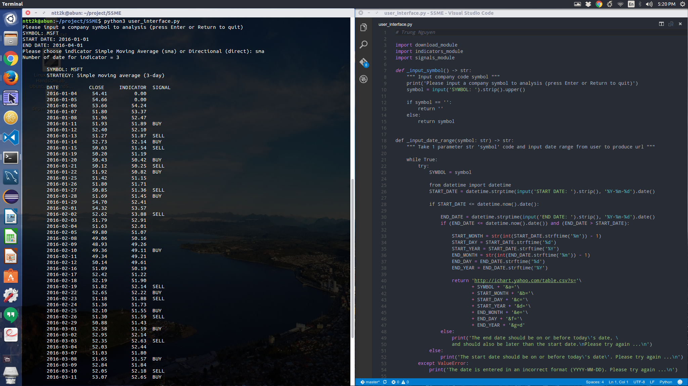
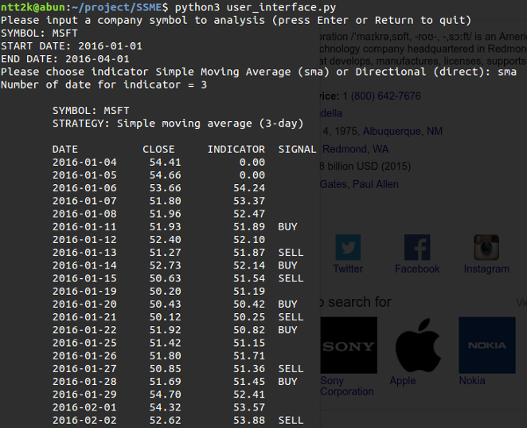

How to run:
==========

On Linux / MacOS / *nix system run command :

$ python3 ./user_interface.py

-----------------------------------------------------------------------

Simple Stock Market Exchange (old school project UCI ICS 32 - Project 3)
------------------------------------------------------------------------

This project loads a set of historical stock prices from the Yahoo web server, calculate a few metrics on those prices, and ultimately report on opportune times to buy or sell the stock, based on one of a few buying-and-selling strategies.

 + Stocks that trade on stock exchanges generally have a symbol (sometimes called a ticker symbol) associated with them, which is a shorthand name that is used to uniquely identify a company on that exchange. In the United States, symbols are generally a sequence of uppercase letters; in some parts of the world, digits are also common. 
 
 For example, the symbol on U.S. stock exchanges for Apple is AAPL, while Google's symbol is GOOG, Microsoft's is MSFT, and Verizon's is VZ.

+ The start date of the analysis. The user should specify the date in the format YYYY-MM-DD (i.e., a four digit year, followed by a dash, followed by a two-digit month, followed by a dash, followed finally by a two-digit day). So, for example, February 4, 2012 would be specified as 2012-02-04. 

    The start date should be on or before today's date; if not, ask the user to specify another.
    If the date is entered in an incorrect format (anything other than YYYY-MM-DD), ask the user to specify another.

+ The end date of the analysis. The user should specify the date in the format YYYY-MM-DD.
The end date should be on or before today's date, and should also be later than the start date; if not, ask the user to specify another.

    If the date is entered in an incorrect format (anything other than YYYY-MM-DD), ask the user to specify another.

Indicators
==========

The core of our analysis will be comparing daily prices against the values of indicators. There are two kinds of indicators we'll use:

+ Simple moving average:
  ---------------------- 

    The N-day simple moving average at the end of a particular day is the average of the most recent N closing prices. Days on which there is no trading are not counted. So, for example, the 10-day simple moving average each day is simply the average of the most recent 10 closing prices. Note that the simple moving average on a particular day includes that day's closing price.

+ Directional indicator:
  ----------------------

    Unlike simple moving averages, directional indicators are always possible to calculate. In a given report, the first day's indicator value will always be 0, because you don't know whether the stock's move that day was up or down (since you don't have the previous day's price). When there are fewer than N days of prices, you simply calculate the directional indicator using the number of days you have available.

Signal strategies:
==================

The main goal of the analysis is to generate buy signals and sell signals, which are recommendations to buy or sell stock at the conclusion of a particular day. There are two strategies, corresponding to the indicators above.

